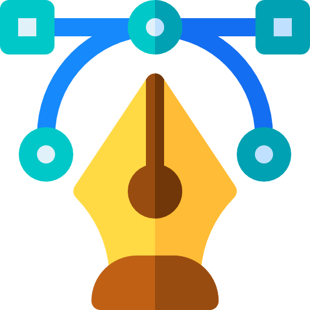

# Hello World, I'm Kaniz 👋🏼

 Programmer &nbsp;|&nbsp;  Learner &nbsp;|&nbsp;  Designer Blending my curiosity with logic.

---

### Statistics

<!-- BEGIN STREAK -->
<picture><source media="(max-width: 768px)" srcset="https://readme-streak-stats-kaniz111.vercel.app/api/?username=kaniz-codes&count_private=true&show_icons=true&include_all_commits=true&custom_title=GitHub%20Stats&rank_icon=percentile&theme=default&hide_border=false" width="100%"/><source media="(prefers-color-scheme: dark)" srcset="https://readme-streak-stats-kaniz111.vercel.app/api/?username=kaniz-codes&count_private=true&show_icons=true&include_all_commits=true&custom_title=GitHub%20Stats&rank_icon=percentile&theme=tokyonight&hide_border=true" width="49%"/><source media="(prefers-color-scheme: light)" srcset="https://readme-streak-stats-kaniz111.vercel.app/api/?username=kaniz-codes&count_private=true&show_icons=true&include_all_commits=true&custom_title=GitHub%20Stats&rank_icon=percentile&theme=default&hide_border=false" width="49%"/>"/></picture>
<!-- END COMP-STREAK -->
<!-- BEGIN COMP-LANG -->
<picture><source media="(max-width: 768px)" srcset="https://readme-streak-stats-kaniz111.vercel.app/api/top-langs/?username=kaniz-codes&layout=compact&langs_count=6&theme=default&hide_border=false" width="100%"/><source media="(prefers-color-scheme: dark)" srcset="https://readme-streak-stats-kaniz111.vercel.app/api/top-langs/?username=kaniz-codes&layout=compact&langs_count=6&theme=tokyonight&hide_border=true" width="37%"/><source media="(prefers-color-scheme: light)" srcset="https://readme-streak-stats-kaniz111.vercel.app/api/top-langs/?username=kaniz-codes&layout=compact&langs_count=6&theme=default&hide_border=false" width="37%"/>"/></picture>
<!-- END COMP-LANG -->

---

### University Repositories
My university coursework archive of course materials, assignments and practice.

  <a href="https://github.com/kaniz-codes/cse342"><picture><source media="(prefers-color-scheme: dark)" srcset="https://readme-streak-stats-kaniz111.vercel.app/api/pin/?username=kaniz-codes&repo=cse342&theme=tokyonight&hide_border=true&description_lines_count=3"/><source media="(prefers-color-scheme: light)" srcset="https://readme-streak-stats-kaniz111.vercel.app/api/pin/?username=kaniz-codes&repo=cse342&theme=default&hide_border=false&description_lines_count=3"/></picture></a>
  <a href="https://github.com/kaniz-codes/cse320"><picture><source media="(prefers-color-scheme: dark)" srcset="https://readme-streak-stats-kaniz111.vercel.app/api/pin/?username=kaniz-codes&repo=cse320&theme=tokyonight&hide_border=true&description_lines_count=3"/><source media="(prefers-color-scheme: light)" srcset="https://readme-streak-stats-kaniz111.vercel.app/api/pin/?username=kaniz-codes&repo=cse320&theme=default&hide_border=false&description_lines_count=3"/></picture></a> 
  <a href="https://github.com/kaniz-codes/cse318"><picture><source media="(prefers-color-scheme: dark)" srcset="https://readme-streak-stats-kaniz111.vercel.app/api/pin/?username=kaniz-codes&repo=cse318&theme=tokyonight&hide_border=true&description_lines_count=3"/><source media="(prefers-color-scheme: light)" srcset="https://readme-streak-stats-kaniz111.vercel.app/api/pin/?username=kaniz-codes&repo=cse318&theme=default&hide_border=false&description_lines_count=3"/></picture></a>
  <a href="https://github.com/kaniz-codes/cse302"><picture><source media="(prefers-color-scheme: dark)" srcset="https://readme-streak-stats-kaniz111.vercel.app/api/pin/?username=kaniz-codes&repo=cse302&theme=tokyonight&hide_border=true&description_lines_count=3"/><source media="(prefers-color-scheme: light)" srcset="https://readme-streak-stats-kaniz111.vercel.app/api/pin/?username=kaniz-codes&repo=cse302&theme=default&hide_border=false&description_lines_count=3"/></picture></a>

  
<b>More repositories</b>

  

    <a href="https://github.com/kaniz-codes/cse210"><picture><source media="(prefers-color-scheme: dark)" srcset="https://readme-streak-stats-kaniz111.vercel.app/api/pin/?username=kaniz-codes&repo=cse210&theme=tokyonight&hide_border=true&description_lines_count=3"/><source media="(prefers-color-scheme: light)" srcset="https://readme-streak-stats-kaniz111.vercel.app/api/pin/?username=kaniz-codes&repo=cse210&theme=default&hide_border=false&description_lines_count=3"/></picture></a>
    <a href="https://github.com/kaniz-codes/cse208"><picture><source media="(prefers-color-scheme: dark)" srcset="https://readme-streak-stats-kaniz111.vercel.app/api/pin/?username=kaniz-codes&repo=cse208&theme=tokyonight&hide_border=true&description_lines_count=3"/><source media="(prefers-color-scheme: light)" srcset="https://readme-streak-stats-kaniz111.vercel.app/api/pin/?username=kaniz-codes&repo=cse208&theme=default&hide_border=false&description_lines_count=3"/></picture></a> 
    <a href="https://github.com/kaniz-codes/cse232"><picture><source media="(prefers-color-scheme: dark)" srcset="https://readme-streak-stats-kaniz111.vercel.app/api/pin/?username=kaniz-codes&repo=cse232&theme=tokyonight&hide_border=true&description_lines_count=3"/><source media="(prefers-color-scheme: light)" srcset="https://readme-streak-stats-kaniz111.vercel.app/api/pin/?username=kaniz-codes&repo=cse232&theme=default&hide_border=false&description_lines_count=3"/></picture></a>
    <a href="https://github.com/kaniz-codes/cse215"><picture><source media="(prefers-color-scheme: dark)" srcset="https://readme-streak-stats-kaniz111.vercel.app/api/pin/?username=kaniz-codes&repo=cse215&theme=tokyonight&hide_border=true&description_lines_count=3"/><source media="(prefers-color-scheme: light)" srcset="https://readme-streak-stats-kaniz111.vercel.app/api/pin/?username=kaniz-codes&repo=cse215&theme=default&hide_border=false&description_lines_count=3"/></picture></a> 
    <a href="https://github.com/kaniz-codes/cse222"><picture><source media="(prefers-color-scheme: dark)" srcset="https://readme-streak-stats-kaniz111.vercel.app/api/pin/?username=kaniz-codes&repo=cse222&theme=tokyonight&hide_border=true&description_lines_count=3"/><source media="(prefers-color-scheme: light)" srcset="https://readme-streak-stats-kaniz111.vercel.app/api/pin/?username=kaniz-codes&repo=cse222&theme=default&hide_border=false&description_lines_count=3"/></picture></a>
    <a href="https://github.com/kaniz-codes/cse101"><picture><source media="(prefers-color-scheme: dark)" srcset="https://readme-streak-stats-kaniz111.vercel.app/api/pin/?username=kaniz-codes&repo=cse101&theme=tokyonight&hide_border=true&description_lines_count=3"/><source media="(prefers-color-scheme: light)" srcset="https://readme-streak-stats-kaniz111.vercel.app/api/pin/?username=kaniz-codes&repo=cse101&theme=default&hide_border=false&description_lines_count=3"/></picture></a>
  

<!-- Kaniz Fatema -->
