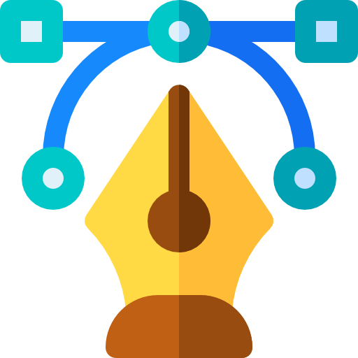
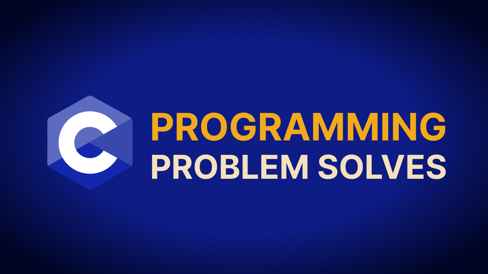
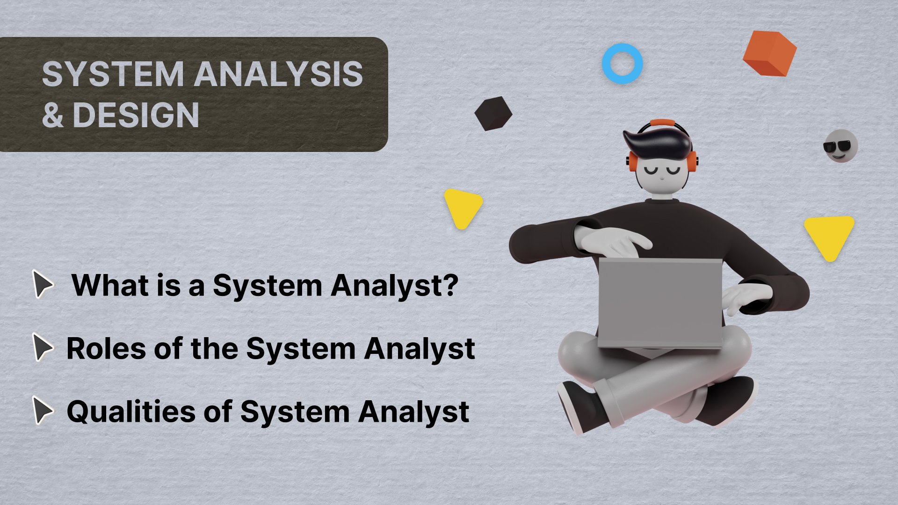
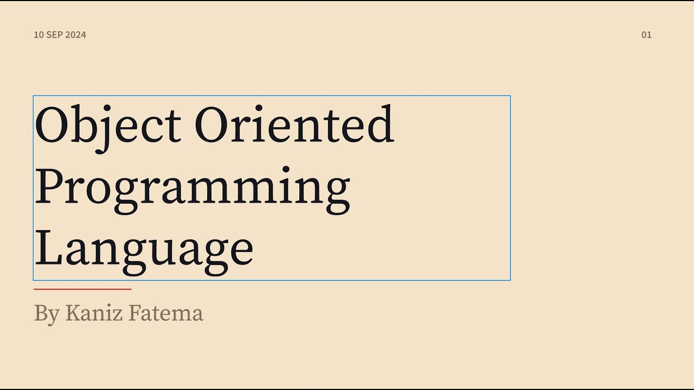

# Hello World, I'm Kaniz 👋🏼

   Programmer &nbsp;|&nbsp;
   Learner &nbsp;|&nbsp;
   Designer
   
  Blending my curiosity with logic.

 

---
### Statistics

<!-- BEGIN STREAK -->
<picture><source media="(max-width: 768px)" srcset="https://readme-streak-stats-kaniz111.vercel.app/api/?username=kaniz-codes&count_private=true&show_icons=true&include_all_commits=true&custom_title=GitHub%20Stats&rank_icon=percentile&theme=default&hide_border=false" width="100%"/><source media="(prefers-color-scheme: dark)" srcset="https://readme-streak-stats-kaniz111.vercel.app/api/?username=kaniz-codes&count_private=true&show_icons=true&include_all_commits=true&custom_title=GitHub%20Stats&rank_icon=percentile&theme=tokyonight&hide_border=true" width="49%"/><source media="(prefers-color-scheme: light)" srcset="https://readme-streak-stats-kaniz111.vercel.app/api/?username=kaniz-codes&count_private=true&show_icons=true&include_all_commits=true&custom_title=GitHub%20Stats&rank_icon=percentile&theme=default&hide_border=false" width="49%"/>"/></picture>
<!-- END COMP-STREAK -->
<!-- BEGIN COMP-LANG -->
<picture><source media="(max-width: 768px)" srcset="https://readme-streak-stats-kaniz111.vercel.app/api/top-langs/?username=kaniz-codes&layout=compact&langs_count=6&theme=default&hide_border=false" width="100%"/><source media="(prefers-color-scheme: dark)" srcset="https://readme-streak-stats-kaniz111.vercel.app/api/top-langs/?username=kaniz-codes&layout=compact&langs_count=6&theme=tokyonight&hide_border=true" width="37%"/><source media="(prefers-color-scheme: light)" srcset="https://readme-streak-stats-kaniz111.vercel.app/api/top-langs/?username=kaniz-codes&layout=compact&langs_count=6&theme=default&hide_border=false" width="37%"/>"/></picture>
<!-- END COMP-LANG -->

---

### YouTube Channel

My learning and study materials on YouTube.

  
  <a href="https://www.youtube.com/@KanizFatemaKF">
    

 
 
 
 

---
### University Repositories
My university coursework archive of course materials, assignments and practice.

  <a href="https://github.com/kaniz-codes/cse404"><picture><source media="(prefers-color-scheme: dark)" srcset="https://readme-streak-stats-kaniz111.vercel.app/api/pin/?username=kaniz-codes&repo=cse404&theme=tokyonight&hide_border=true&description_lines_count=3"/><source media="(prefers-color-scheme: light)" srcset="https://readme-streak-stats-kaniz111.vercel.app/api/pin/?username=kaniz-codes&repo=cse404&theme=default&hide_border=false&description_lines_count=3"/></picture></a><!-- CSE 404 -->
  <a href="https://github.com/kaniz-codes/cse328"><picture><source media="(prefers-color-scheme: dark)" srcset="https://readme-streak-stats-kaniz111.vercel.app/api/pin/?username=kaniz-codes&repo=cse328&theme=tokyonight&hide_border=true&description_lines_count=3"/><source media="(prefers-color-scheme: light)" srcset="https://readme-streak-stats-kaniz111.vercel.app/api/pin/?username=kaniz-codes&repo=cse328&theme=default&hide_border=false&description_lines_count=3"/></picture></a><!-- CSE 328 -->
  <a href="https://github.com/kaniz-codes/mkt301"><picture><source media="(prefers-color-scheme: dark)" srcset="https://readme-streak-stats-kaniz111.vercel.app/api/pin/?username=kaniz-codes&repo=mkt301&theme=tokyonight&hide_border=true&description_lines_count=3"/><source media="(prefers-color-scheme: light)" srcset="https://readme-streak-stats-kaniz111.vercel.app/api/pin/?username=kaniz-codes&repo=mkt301&theme=default&hide_border=false&description_lines_count=3"/></picture></a><!-- MKT 301 -->
  <a href="https://github.com/kaniz-codes/act301"><picture><source media="(prefers-color-scheme: dark)" srcset="https://readme-streak-stats-kaniz111.vercel.app/api/pin/?username=kaniz-codes&repo=act301&theme=tokyonight&hide_border=true&description_lines_count=3"/><source media="(prefers-color-scheme: light)" srcset="https://readme-streak-stats-kaniz111.vercel.app/api/pin/?username=kaniz-codes&repo=act301&theme=default&hide_border=false&description_lines_count=3"/></picture></a><!-- ACT 301 -->
  <a href="https://github.com/kaniz-codes/cse324"><picture><source media="(prefers-color-scheme: dark)" srcset="https://readme-streak-stats-kaniz111.vercel.app/api/pin/?username=kaniz-codes&repo=cse324&theme=tokyonight&hide_border=true&description_lines_count=3"/><source media="(prefers-color-scheme: light)" srcset="https://readme-streak-stats-kaniz111.vercel.app/api/pin/?username=kaniz-codes&repo=cse324&theme=default&hide_border=false&description_lines_count=3"/></picture></a><!-- CSE 324 -->
  <a href="https://github.com/kaniz-codes/cse326"><picture><source media="(prefers-color-scheme: dark)" srcset="https://readme-streak-stats-kaniz111.vercel.app/api/pin/?username=kaniz-codes&repo=cse326&theme=tokyonight&hide_border=true&description_lines_count=3"/><source media="(prefers-color-scheme: light)" srcset="https://readme-streak-stats-kaniz111.vercel.app/api/pin/?username=kaniz-codes&repo=cse326&theme=default&hide_border=false&description_lines_count=3"/></picture></a> <!-- CSE 326 -->
  

  

  
<b>More repositories here</b>

  <a href="https://github.com/kaniz-codes/cse322"><picture><source media="(prefers-color-scheme: dark)" srcset="https://readme-streak-stats-kaniz111.vercel.app/api/pin/?username=kaniz-codes&repo=cse322&theme=tokyonight&hide_border=true&description_lines_count=3"/><source media="(prefers-color-scheme: light)" srcset="https://readme-streak-stats-kaniz111.vercel.app/api/pin/?username=kaniz-codes&repo=cse322&theme=default&hide_border=false&description_lines_count=3"/></picture></a><!-- CSE 322 -->
  <a href="https://github.com/kaniz-codes/cse342"><picture><source media="(prefers-color-scheme: dark)" srcset="https://readme-streak-stats-kaniz111.vercel.app/api/pin/?username=kaniz-codes&repo=cse342&theme=tokyonight&hide_border=true&description_lines_count=3"/><source media="(prefers-color-scheme: light)" srcset="https://readme-streak-stats-kaniz111.vercel.app/api/pin/?username=kaniz-codes&repo=cse342&theme=default&hide_border=false&description_lines_count=3"/></picture></a> <!-- CSE 342 -->
  <a href="https://github.com/kaniz-codes/cse320"><picture><source media="(prefers-color-scheme: dark)" srcset="https://readme-streak-stats-kaniz111.vercel.app/api/pin/?username=kaniz-codes&repo=cse320&theme=tokyonight&hide_border=true&description_lines_count=3"/><source media="(prefers-color-scheme: light)" srcset="https://readme-streak-stats-kaniz111.vercel.app/api/pin/?username=kaniz-codes&repo=cse320&theme=default&hide_border=false&description_lines_count=3"/></picture></a><!-- CSE 320 -->
  <a href="https://github.com/kaniz-codes/cse318"><picture><source media="(prefers-color-scheme: dark)" srcset="https://readme-streak-stats-kaniz111.vercel.app/api/pin/?username=kaniz-codes&repo=cse318&theme=tokyonight&hide_border=true&description_lines_count=3"/><source media="(prefers-color-scheme: light)" srcset="https://readme-streak-stats-kaniz111.vercel.app/api/pin/?username=kaniz-codes&repo=cse318&theme=default&hide_border=false&description_lines_count=3"/></picture></a> <!-- CSE 318 -->
  <a href="https://github.com/kaniz-codes/cse302"><picture><source media="(prefers-color-scheme: dark)" srcset="https://readme-streak-stats-kaniz111.vercel.app/api/pin/?username=kaniz-codes&repo=cse302&theme=tokyonight&hide_border=true&description_lines_count=3"/><source media="(prefers-color-scheme: light)" srcset="https://readme-streak-stats-kaniz111.vercel.app/api/pin/?username=kaniz-codes&repo=cse302&theme=default&hide_border=false&description_lines_count=3"/></picture></a><!-- CSE 302 -->
  <a href="https://github.com/kaniz-codes/cse210"><picture><source media="(prefers-color-scheme: dark)" srcset="https://readme-streak-stats-kaniz111.vercel.app/api/pin/?username=kaniz-codes&repo=cse210&theme=tokyonight&hide_border=true&description_lines_count=3"/><source media="(prefers-color-scheme: light)" srcset="https://readme-streak-stats-kaniz111.vercel.app/api/pin/?username=kaniz-codes&repo=cse210&theme=default&hide_border=false&description_lines_count=3"/></picture></a><!-- CSE 210 -->
  <a href="https://github.com/kaniz-codes/cse208"><picture><source media="(prefers-color-scheme: dark)" srcset="https://readme-streak-stats-kaniz111.vercel.app/api/pin/?username=kaniz-codes&repo=cse208&theme=tokyonight&hide_border=true&description_lines_count=3"/><source media="(prefers-color-scheme: light)" srcset="https://readme-streak-stats-kaniz111.vercel.app/api/pin/?username=kaniz-codes&repo=cse208&theme=default&hide_border=false&description_lines_count=3"/></picture></a><!-- CSE 208 -->
  <a href="https://github.com/kaniz-codes/cse232"><picture><source media="(prefers-color-scheme: dark)" srcset="https://readme-streak-stats-kaniz111.vercel.app/api/pin/?username=kaniz-codes&repo=cse232&theme=tokyonight&hide_border=true&description_lines_count=3"/><source media="(prefers-color-scheme: light)" srcset="https://readme-streak-stats-kaniz111.vercel.app/api/pin/?username=kaniz-codes&repo=cse232&theme=default&hide_border=false&description_lines_count=3"/></picture></a><!-- CSE 232 -->
  <a href="https://github.com/kaniz-codes/cse215"><picture><source media="(prefers-color-scheme: dark)" srcset="https://readme-streak-stats-kaniz111.vercel.app/api/pin/?username=kaniz-codes&repo=cse215&theme=tokyonight&hide_border=true&description_lines_count=3"/><source media="(prefers-color-scheme: light)" srcset="https://readme-streak-stats-kaniz111.vercel.app/api/pin/?username=kaniz-codes&repo=cse215&theme=default&hide_border=false&description_lines_count=3"/></picture></a><!-- CSE 215 -->
  <a href="https://github.com/kaniz-codes/cse222"><picture><source media="(prefers-color-scheme: dark)" srcset="https://readme-streak-stats-kaniz111.vercel.app/api/pin/?username=kaniz-codes&repo=cse222&theme=tokyonight&hide_border=true&description_lines_count=3"/><source media="(prefers-color-scheme: light)" srcset="https://readme-streak-stats-kaniz111.vercel.app/api/pin/?username=kaniz-codes&repo=cse222&theme=default&hide_border=false&description_lines_count=3"/></picture></a><!-- CSE 222 -->
  <a href="https://github.com/kaniz-codes/cse111"><picture><source media="(prefers-color-scheme: dark)" srcset="https://readme-streak-stats-kaniz111.vercel.app/api/pin/?username=kaniz-codes&repo=cse111&theme=tokyonight&hide_border=true&description_lines_count=3"/><source media="(prefers-color-scheme: light)" srcset="https://readme-streak-stats-kaniz111.vercel.app/api/pin/?username=kaniz-codes&repo=cse111&theme=default&hide_border=false&description_lines_count=3"/></picture></a><!-- CSE 111 -->
  <a href="https://github.com/kaniz-codes/cse101"><picture><source media="(prefers-color-scheme: dark)" srcset="https://readme-streak-stats-kaniz111.vercel.app/api/pin/?username=kaniz-codes&repo=cse101&theme=tokyonight&hide_border=true&description_lines_count=3"/><source media="(prefers-color-scheme: light)" srcset="https://readme-streak-stats-kaniz111.vercel.app/api/pin/?username=kaniz-codes&repo=cse101&theme=default&hide_border=false&description_lines_count=3"/></picture></a><!-- CSE 101 -->
  

  

<!-- repository cards here -->

<!-- Kaniz Fatema -->
